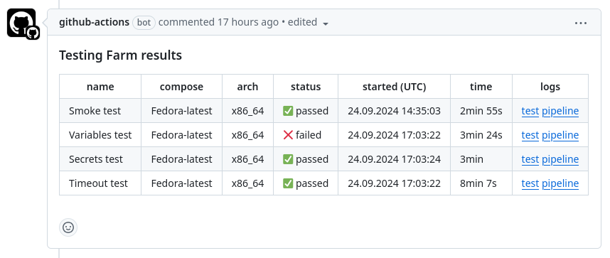

# testing-farm-as-github-action

[![codecov][codecov-status]][codecov]

[codecov]: https://codecov.io/github/sclorg/testing-farm-as-github-action
[codecov-status]: https://codecov.io/github/sclorg/testing-farm-as-github-action/graph/badge.svg

Testing Farm as GitHub Action is a GitHub Action for executing tests on the [Testing Farm Service](https://docs.testing-farm.io). Action using Node.js Library [testing-farm](https://www.npmjs.com/package/testing-farm) for communication with Testing Farm API.

The tests to run are to be described with a [`tmt` plan](https://tmt.readthedocs.io/en/stable/guide.html#plans) by the user of this GitHub Action.
Pull Request status is automatically updated after the tests are executed,
if this option is enabled with the `update_pull_request_status` user-defined input variable.

API key to the Testing Farm MUST be stored in your organization's secrets to successfully access its infrastructure.
See [Testing Farm onboarding guide](https://docs.testing-farm.io/Testing%20Farm/0.1/onboarding.html) for information how to onboard to Testing Farm.

## Compatibility Notes

> [!IMPORTANT]
>
> Currently only testing of copr builds is supported by the action.
> See [Testing Farm docs](https://docs.testing-farm.io) for more information on supported test artifacts which Testing > > Farm can install into the environment.

## Action Inputs

### Testing Farm

| Input Name | Description | Default value |
|------------|-------------|---------------|
| `api_key`  | Testing farm API key | empty, **required from user** |
| `api_url`  | Testing farm API server url | https://api.dev.testing-farm.io/v0.1 |
| `tf_scope` | Define the scope of Testing Farm. Possible options are 'public' or 'private' | public |

### Tmt Metadata

| Input Name | Description | Default value |
|------------|-------------|---------------|
| `git_url` | An url to the repository with tmt metadata | url of repo that runs GHA |
| `git_ref` | A tmt tests branch, tag or commit specifying the desired git revision which will be used for tests | `github.ref` when available, otherwise `master` |
| `tmt_plan_regex` | A regular expression used to select tmt plans | all |
| `tmt_plan_filter` | A filter used to select tmt plans [plan_filter](https://docs.testing-farm.io/Testing%20Farm/0.1/test-request.html#plan-filter) | "" |
| `tmt_context` | A mapping of tmt context variable [tmt-context](https://tmt.readthedocs.io/en/latest/spec/context.html), variables separated by ; | empty |
| `tmt_path` |  A path in the repository with tmt metadata | "." |

### Test Environment

| Input Name | Description | Default value |
|------------|-------------|---------------|
| `compose` | Compose to run tests on. [Available composes.](https://api.dev.testing-farm.io/v0.1/composes) | Fedora-latest |
| `arch` | Define an architecture for testing environment | x86_64 |
| `variables` | Environment variables for test env, separated by ; | empty |
| `secrets` | Environment secrets for test env, separated by ; | empty |
| `tmt_hardware` | Hardware definition for test env | empty |

### Test Artifacts

| Input Name | Description | Default value |
|------------|-------------|---------------|
| `copr` | Copr name to use for the artifacts | epel-7-x86_64 |
| `copr_artifacts` | `fedora-copr-build` artifacts for testing environment, separated by ; | empty |

### Miscellaneous

| Input Name | Description | Default value |
|------------|-------------|---------------|
| `github_token` | GitHub token passed from secrets | `${{ github.token }}` |
| `create_issue_comment` | If GitHub action will create a github issue comment | false |
| `pull_request_status_name` | GitHub pull request status name is also used as the name of the test in the Job Summary and in comments. | Fedora |
| `update_pull_request_status` | Action will update pull request status. | false |
| `environment_settings` | Pass custom settings to the test environment. | empty |
| `pipeline_settings` | Pass specific settings for the testing farm pipeline. For example, `'{ "type": "tmt-multihost" }'`. For details, see `settings.pipeline` field in [Request new test](https://api.testing-farm.io/redoc#operation/request_a_new_test_v0_1_requests_post). | empty |
| `create_github_summary` | Create GitHub Job Summary accessible from Workflow run Summary. Possible options: "true" or "false" | true |
| `timeout` | Timeout for the Testing Farm job in minutes. | 480 |
| `repo_owner` | Owner of the repository | `${{ github.repository_owner }}` |
| `repo_name` | Name of the repository | undefined |
| `pr_number` | Pull request number for showing the results | undefined |
| `commit_sha` | Sha of the commit triggering the action | undefined |

## Action Outputs

| Output Name | Description |
|-------------|-------------|
| `request_id` | An ID of a scheduled testing farm request. |
| `request_url` | An URL of a scheduled testing farm request. |
| `test_log_url` | An URL of a scheduled test logs. |

> [!TIP]
>
> Testing Farm as GitHub Action requires a GitHub token with the following permissions:
>
> ```yaml
> permissions:
>   contents: read
>   # This is required for the ability to create Issue comment
>   pull-requests: write
>   # This is required for the ability to create/update the Pull request status
>   statuses: write
> ```

## Examples

### Pull request example

The example below shows how the `sclorg/testing-farm-as-github-action` action can be used to schedule tests on Testing Farm.

```yaml
name: Schedule test on Testing Farm
on:
  issue_comment:
    types:
      - created

# The concurrency key is used to prevent multiple workflows from running at the same time
concurrency:
  group: my-concurrency-group
  cancel-in-progress: true

jobs:
  tests:
    runs-on: ubuntu-latest
    # Let's schedule tests only on user request. NOT automatically.
    # Only repository owner or member can schedule tests
    if: |
      github.event.issue.pull_request
      && contains(github.event.comment.body, '[test]')
      && contains(fromJson('["OWNER", "MEMBER"]'), github.event.comment.author_association)
    steps:
      - name: Schedule test on Testing Farm
        uses: sclorg/testing-farm-as-github-action@v3
        with:
          api_key: ${{ secrets.TF_API_KEY }}
          tmt_plan_regex: "centos"
          pull_request_status_name: "CentOS 7"
```

and as soon as the job is finished you will see the test results in the pull request status:

✅ | ❌ Testing Farm - CentOS 7 - Build finished

### Run workflow at push to the main branch

The example below shows how the `sclorg/testing-farm-as-github-action` action can be used when pushing commits to `main` branch.

```yaml
name: Testing repository by Testing Farm when push to main branch
on:
  push:
    branches:
      - main

# The concurrency key is used to prevent multiple workflows from running at the same time
concurrency:
  group: ${{ github.head_ref }}
  cancel-in-progress: true

jobs:
  tests:
    runs-on: ubuntu-latest
    steps:
      - name: Schedule test on Testing Farm
        uses: sclorg/testing-farm-as-github-action@v3
        with:
          api_key: ${{ secrets.TF_API_KEY }}
```

### How to setup Pull Request summary comments

Set the following inputs:

- `create_issue_comment: 'true'`
- `pull_request_status_name: 'Test name'`

Action uses the `pull_request_status_name` as the name of the test. Also it is used to distinguish between different tests when running multiple tests in parallel.

<p align="center">
  
</p>

> [!WARNING]
>
> When running multiple tests in parallel, you can encounter race conditions when updating the summary comment. We have implemented a locking mechanism to prevent this issue, but currently there is no proper way how to synchronize independent workflow jobs. Statuses are updated independently so they don't have this issue and are always up to date.
